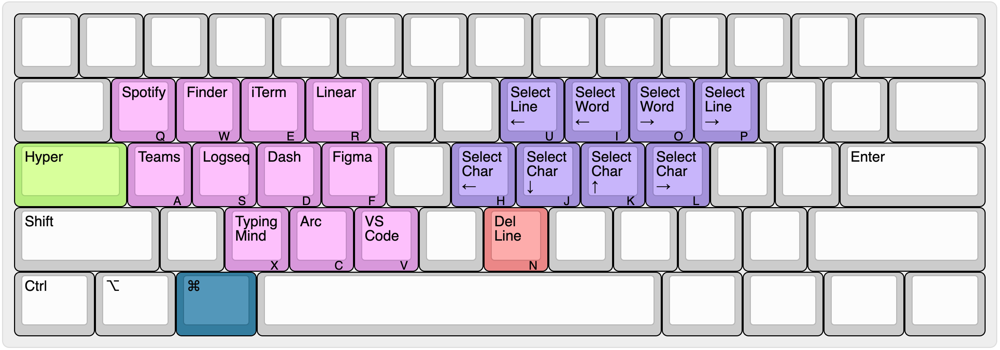

# HyperCapslock

> Make CapsLock Great Again!

## Idea

**CapsLock** is a key that is rarely used, though it is in a prime location on the keyboard (right on the homerow). This project makes CapsLock more useful by remapping it to a **Hyper** key, which is basically a combination of Command, Control, Option, and Shift pressed together. This enables a lot of powerful keybindings that are easy to reach.

<details>
  <summary>But what if want to use CapsLock?</summary>

Don't worry, you can still use CapsLock by pressing `CapsLock` + `Escape`.

</details>

## My keymaps

One important principle for my keymaps is that they should not alter the default behavior of the keys, except for the CapsLock key. Since Hyper is basically a modifier, this can be done easily and allows me to switch between different keyboards without too much trouble getting used to them.

### Hyper layer


This layer is activated by simply **holding** the `CapsLock` (`Hyper`) key. If you press and release it, then the key will act as `Escape`.

On the right hand side:
- `Hyper` + `hjkl` for arrow keys.
- `Hyper` + `uiop` for jumping words/lines.
- `Hyper` + `nm` for deleting words/characters.

On the left hand side:
- Frequently used programming symbols.

On the number row:
- Change display brightness.
- Change volume.
- Media keys.

`Hyper` + `Space` is used to switch between different input methods.

### Hyper + Command layer



By holding `Command` key from the Hyper layer, we have access to more keybindings.

On the right hand side I keep the same motions as the Hyper layer but the keys become their shifted versions:
- `Hyper` + `hjkl` for selecting characters.
- `Hyper` + `uiop` for selecting words/lines.
- `Hyper` + `n` for deleting the whole line.

On the left hand side I assign shortcuts to launch my frequently used apps.

## Install

1. Install [Karabiner-Elements](https://github.com/pqrs-org/Karabiner-Elements). Give the necessary permissions that it asks.

2. Clone this repo:

    ```bash
    git clone git@github.com:hellovietduc/HyperCapslock.git
    ```

3. Install the dependencies:

    ```bash
    yarn install
    ```

    The keymaps in this repo are built with [karabiner.ts](https://github.com/evan-liu/karabiner.ts).

4. Install the keymaps:

    ```bash
    yarn hyper
    ```

## Credits

This project started as a fork of [Vonng/Capslock](https://github.com/Vonng/Capslock) but have diverged significantly due to my own personal setup. However, I would like to thank Vonng for the original idea and code.
